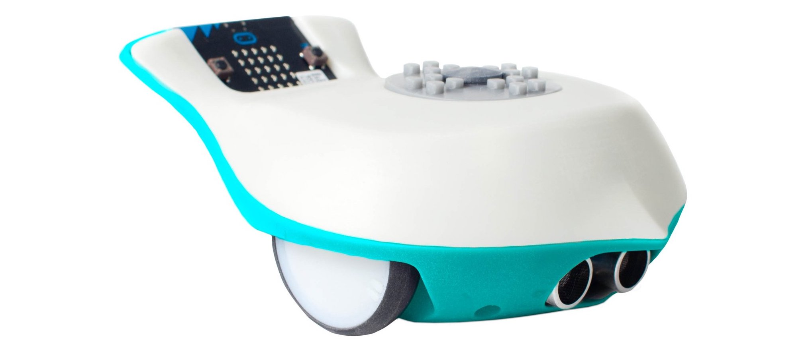
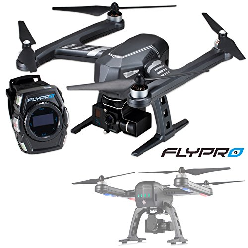

# ProductDesignPortfolio

- I have 4 years of product design experience primarily using SolidWorks and Autodesk Fusion 360

- Here are some examples of projects I worked on which were successfully desployed:

#### Product Name: [Finch 2.0](https://www.birdbraintechnologies.com/finch2/),  Company: BirdBrain Technologies LLC,  Country: USA,  Year: 2017
- Robotics developer position which involved designing the successor to the existing Finch product. Design encompassed every facet of mechatronics, with the mechanical design shown below:

#### Product Name: [XEagle](http://www.flypro.com/en-xeagle_professional.htm) ,  Company Name: FlyPro,  Country: China,  Year: 2015
- Mechanical design internship which involved designing the physical encasing and shell of the XEagle drone.
 
